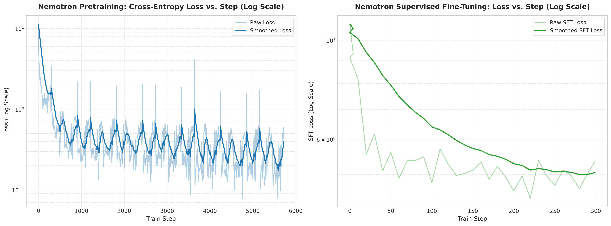
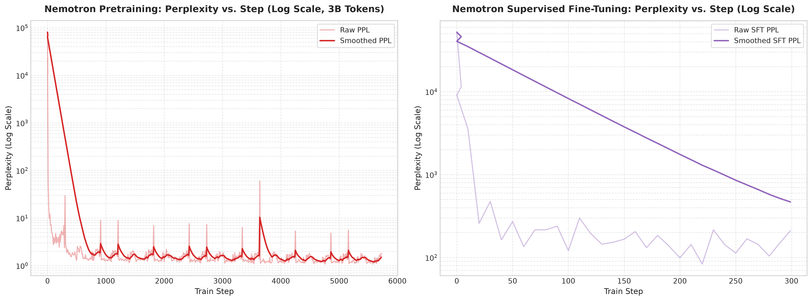
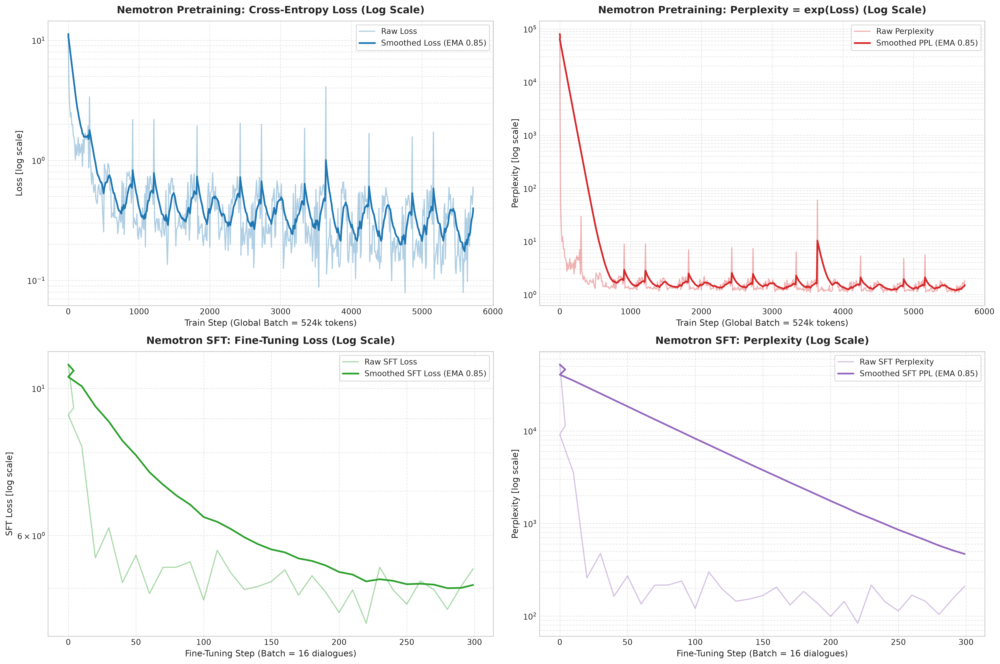

# Training report: 3B token GPT 2 pretraining and SFT on Nemotron dataset

This report documents the pretraining and supervised fine-tuning runs for the GPT-2 base model on the Nemotron dataset.

## Model configuration

The model uses the GPT-2 small transformer architecture:
- Layers: 12
- Hidden dimension: 768
- Attention heads: 6 query heads, 6 key-value heads (head dimension 128)
- Sequence length: 1,024 tokens
- Vocabulary size: 50,257 tokens (GPT-2 byte-pair encoding)
- Rotary positional embeddings with base frequency 10,000
- QK normalization and RMSNorm on transformer blocks
- Logit softcapping at 15.0

## Pretraining run

### Dataset and data volume
- Source: NVIDIA Nemotron-RL-Ultra-Training-Blends
- Subsets: rlvr1, rlvr2, mopd, ifbench
- Shard format: 300 pre-tokenized binary files containing 10,000,000 tokens each
- Total tokens trained: 2,999,975,936 tokens (approximately 3.0 billion tokens)

### Training parameters
- Total steps: 5,722 steps
- Sequence length: 1,024 tokens
- Sequences per step: 512
- Effective batch size: 524,288 tokens per step
- Optimizer: AdamW
- Peak learning rate: 6e-4
- Learning rate schedule: Linear warmup over 70 steps, then cosine decay to 6e-5 (10% of peak)
- Weight decay: 0.1
- Adam betas: beta1 = 0.9, beta2 = 0.95
- Gradient clipping: 1.0

### Loss and perplexity progression

Training started with cross-entropy loss at 11.30 and perplexity at 80,569.00. By step 100, loss fell to 1.01. The loss continued to decline across the 3 billion tokens, reaching a minimum near 0.14 before ending at 0.52 on the final batch.

| Step | Tokens seen | Loss | Perplexity |
|---|---|---|---|
| 0 | 65,536 | 11.30 | 80,569.00 |
| 100 | 52,428,800 | 1.01 | 2.74 |
| 500 | 262,144,000 | 0.25 | 1.29 |
| 1,000 | 524,288,000 | 0.27 | 1.30 |
| 2,000 | 1,048,576,000 | 0.19 | 1.21 |
| 3,000 | 1,572,864,000 | 0.47 | 1.60 |
| 4,000 | 2,097,152,000 | 0.19 | 1.21 |
| 5,000 | 2,621,440,000 | 0.14 | 1.15 |
| 5,700 | 2,988,441,600 | 0.50 | 1.65 |
| 5,721 (final) | 2,999,975,936 | 0.52 | 1.69 |

A 100-step moving average smooths local batch variance:
- Step 90: 4.79 loss, 11,423.77 perplexity
- Step 1,000: 0.42 loss, 1.53 perplexity
- Step 2,000: 0.26 loss, 1.30 perplexity
- Step 3,770: 0.21 loss, 1.23 perplexity
- Step 5,620: 0.17 loss, 1.19 perplexity
- Step 5,721: 0.39 loss, 1.49 perplexity

The 1,000-step moving average declined monotonically from 1.18 at step 970 to 0.30 at step 5,690.

## Supervised fine-tuning run

### Dataset and data volume
- Source: Nemotron multi-turn dialogue pairs
- File: nemotron_sft.jsonl
- Samples: 10,000 dialogue examples
- Total tokens trained: 4,915,200 tokens across 300 steps
- Weight initialization: Restored directly from pretraining step 5,722

### Training parameters
- Total steps: 300 steps
- Sequence length: 1,024 tokens
- Sequences per step: 16
- Effective batch size: 16,384 tokens per step
- Optimizer: AdamW
- Peak learning rate: 5e-5
- Learning rate schedule: Cosine decay to 5e-6
- Weight decay: 0.01
- Gradient clipping: 1.0

### Loss and perplexity progression

The fine-tuning loss started at 10.86 (perplexity 52,159.59) on the conversational prompt format. It fell below 6.0 within 50 steps and reached 4.64 (perplexity 104.03) near step 280.

| Step | SFT loss | Perplexity |
|---|---|---|
| 0 | 10.86 | 52,159.59 |
| 10 | 8.18 | 3,553.06 |
| 50 | 5.60 | 271.11 |
| 100 | 4.80 | 121.09 |
| 150 | 5.11 | 166.36 |
| 200 | 4.60 | 99.05 |
| 250 | 4.73 | 113.05 |
| 280 | 4.64 | 104.03 |
| 299 (final) | 5.35 | 209.73 |

## Convergence charts

### Loss convergence
The chart below plots pretraining cross-entropy loss and fine-tuning loss on a logarithmic scale. The raw data appears as a faint line, and the solid line shows an exponential moving average with a smoothing weight of 0.85.

### Perplexity convergence
Perplexity follows the relation `PPL = exp(Loss)`. Logarithmic scaling on the vertical axis resolves both the initial drop from 80,000 and the fine-grained progression between 1.15 and 2.0.

### Combined training overview
The four-panel view brings together pretraining and fine-tuning trajectories for loss and perplexity.

## Analysis of outcomes

The base model converged steadily on symbolic tokens and reasoning traces from the Nemotron blends, dropping cross-entropy loss from 11.30 to under 0.20 on math shards. 

The SFT stage demonstrated that 300 steps was enough to learn conversational formatting and turn taking, but not enough to internalize new factual knowledge. The model attempts to structure responses into conversational clauses or tables, yet lacks broad factual recall. That fits expectations for a 124M parameter model trained on 3B tokens of specialized reasoning data.
